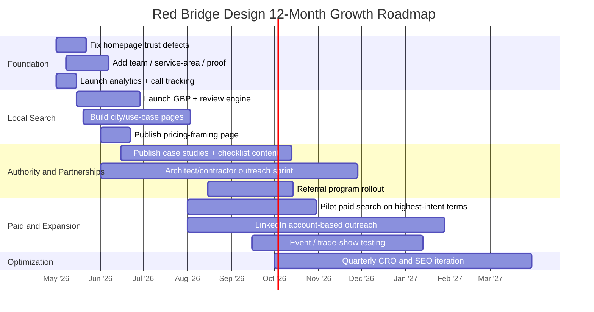

# Red Bridge Design and the San Francisco Bay Area As-Built Drawings Market

## Executive Summary

Red Bridge Design presents itself clearly as a specialist in as-built drawings and existing-conditions documentation. The site communicates a focused offer, fast turnaround, fixed-fee quoting, unlimited revisions, CAD/BIM deliverables, and a workflow that should appeal to architects, contractors, developers, and property owners. The positioning line is strong and specific: field-verified, permit-ready, delivered fast. The problem is not the offer itself; it is the proof architecture around the offer. The publicly visible site is essentially a single long-form landing page with no named team members, no visible office address, no public pricing, limited case-study depth, and several trust gaps, including homepage counters rendering as “0+ / 0 yrs / 0%,” which is the kind of visual bug that undercuts credibility at exactly the moment a prospective client is deciding whether to submit a quote request. citeturn0view0turn36view2turn36view1

The Bay Area competitive set is fragmented into three tiers. One tier plays the value and permit-fix game, with contractor-led or drafting-led firms emphasizing affordability, retroactive permits, code-violation correction, and quote-based service. A second tier consists of local boutique specialists whose advantage is repeat relationships with architects and property managers. A third tier is the premium scan-to-BIM / survey-grade segment, where firms emphasize LiDAR, point clouds, BIM, preservation, engineering-grade workflows, and institutional or large-commercial credibility. Red Bridge currently reads like a boutique specialist trying to serve both residential and commercial work, but without the visible proof depth of firms such as entity["company","Fog City As-builts","bay area as-built firm"], entity["company","Prime Edge LLC","union city as-built firm"], or entity["company","3D Virtual Design Technology","san francisco scan firm"], and without the pricing transparency of entity["company","Alterpex","bim technology company"] or entity["company","Asbuilt Services","measured drawings firm"]. citeturn8view0turn12search0turn19search0turn21search0turn26search0

Market demand in the Bay Area is structurally real. It is driven by remodels and additions that require existing and proposed drawings, ADU activity under updated California law, seismic retrofit programs, historic-preservation review, older housing stock, and an ongoing shift toward digital submissions and more formalized permit workflows. In entity["city","San Francisco","california, us"], full permit plans require separate existing and proposed floor plans; in entity["city","Oakland","california, us"], additions and habitable-space conversions require permits and plan submittals that distinguish existing, proposed, and removed elements; and in entity["city","San Jose","california, us"], ADU submissions require site plans, floor plans, and elevations. Meanwhile, seismic-retrofit programs in all three cities create recurring documentation demand for existing building conditions. citeturn28search0turn28search22turn30search29turn29search8turn30search0turn30search11turn30search4

The highest-return path for Red Bridge is not “more marketing” in the abstract. It is a sequence. First, fix the trust and conversion leaks on the website. Second, build local-search authority around explicit city/use-case pages and a properly managed Google Business Profile. Third, develop a repeatable partner channel with architects, design-build contractors, permit expeditors, and preservation consultants. Fourth, add selective paid acquisition only after the offer, proof, and landing-page structure are credible enough to convert non-referral traffic efficiently. That sequence is what closes the gap between a good boutique practice and a dependable lead engine.

## Current State of Red Bridge Design

The site’s message is coherent: Red Bridge is selling measured reality, not design theater. It offers architectural drafting, as-built drawings, permit sets, commercial/multi-family documentation, and 3D/BIM outputs, and it frames those services around renovations, permits, property sales, and facilities work. The workflow is also easy to understand: quote, measure, draft/review, deliver. That part is well done. citeturn0view0turn36view2

| Dimension | What the public site shows | Assessment | Sources |
|---|---|---|---|
| Services offered | Architectural drafting; as-built drawings; permit sets; commercial/multi-family documentation; 3D modeling / BIM; tenant-improvement as-builts; ADA documentation; scan-to-BIM coordination. | Broad enough to serve residential and light-commercial demand; still most believable as an existing-conditions specialist rather than a full architectural practice. | citeturn0view0turn36view2 |
| Target clients | Architects, contractors, developers, property owners; renovation, permit, sale, and facilities-management use cases; commercial and residential project examples. | Targeting is sensible and commercially relevant. The copy speaks most naturally to architects/contractors first and owners second. | citeturn0view0turn36view2 |
| Portfolio quality | Five sample projects are shown, mostly residential plus one commercial project, with sheet counts from 4 to 10. Software badges cite AutoCAD 2025, Revit 2025, and SketchUp Pro. | Adequate as a teaser, but thin as proof. There is no project narrative, no before/after, no client outcome, no square footage, no downloadable full sample set, and one preview image appears to contain mismatched embedded text (“Pine St Residence / Draftline Studio”) under a different listed address, which creates avoidable doubt about whether portfolio imagery is fully project-specific. | citeturn36view2 |
| Pricing visibility | Fixed-fee proposal promised within 4 hours; standard turnaround 5–7 business days; rush 48–72 hours. No public rates or price ranges. | The fixed-fee language reduces friction, but complete price opacity leaves Red Bridge behind competitors that publish at least starting prices or per-square-foot anchors. | citeturn36view0turn36view1 |
| Team and credentials | “Founded in 2011” and “8,500+ as-built surveys and drawing projects.” No named principals, bios, licenses, certifications, project resumes, or office photos were visible on the reviewed page. | This is the largest trust gap after the broken counters. For a site that asks buyers to trust field accuracy, the absence of human credentials weakens E-E-A-T considerably. | citeturn36view0turn36view1 |
| Lead capture and contact | Quote form asks for name, email, phone, service needed, project size, description, and rush timing. Phone, email, and office hours are public. The site promises a reply within 4 business hours. | Good basic lead capture. Missing upgrades include calendar booking, downloadable samples, review-platform proof, and a stronger qualification path for commercial leads. | citeturn36view1 |
| Testimonials and trust proof | Four strong testimonials from named individuals with titles and firms; comments emphasize accuracy, preservation detail, speed, and permit readiness. | Helpful, but all proof is first-party. There are no links to third-party reviews, no logos tied to case studies, and no external validation of the named firms or projects. | citeturn36view0turn36view1 |
| Brand positioning | “Field-Verified · Permit-Ready · Delivered Fast,” plus claims around fast turnaround, unlimited revisions, all file formats, and remote-capable collaboration. | Strong positioning statement. It places Red Bridge in the “specialist documentation partner” slot rather than “general drafting outsourcer.” That is the right lane. | citeturn0view0turn36view0turn36view1 |
| SEO and UX issues | Homepage counters display as zeros; no visible city-specific pages or resource center were surfaced in the reviewed public page; only one main page URL was reviewed; no visible address/NAP detail beyond phone/email; the copy also stresses nationwide remote capability. | The biggest issues are local-search weakness and credibility leakage. The site can likely convert referrals and branded searches, but it is not yet structured like a search-first authority property for city/use-case intent. The “remote-capable nationwide” message is useful operationally but dilutes local relevance unless paired with explicit Bay Area service-area signals. | citeturn0view0turn36view0turn36view1 |
| Missing or unclear information | No published service area map; no named staff; no professional registrations/licenses; no sample deliverable download; no price anchors; no real-world case-study depth; no external review links; no visible physical office address. | These omissions matter because buyers in this category are risk-averse. They are usually choosing between “good enough and cheap” versus “accurate enough to keep permits, pricing, and design from going sideways.” The site needs to prove it belongs in the second bucket. | citeturn36view0turn36view1 |

The short version: the site explains *what* Red Bridge does, but it does not yet prove *why* Red Bridge should win against older local specialists, scan-heavy premium firms, or low-cost permit-fix competitors. In practical terms, this feels like a capable referral landing page that has not yet been fully engineered to dominate local non-brand search or cold inbound conversion. citeturn36view0turn36view1turn35search5turn35search15

## Bay Area Competitor Landscape

The competitive field is active, uneven, and surprisingly transparent in pockets. Some firms compete on history and repeat architect relationships, some on contractor/problem-solving practicality, and some on technology and survey-grade precision. Public price transparency is still rare, but the firms that do publish anchors create a trust advantage because they shrink the uncertainty buyers feel before making first contact. citeturn8view0turn18search0turn19search0turn21search0turn26search0

| Competitor | Base / footprint | Services | Public pricing | USP | Estimated positioning | Website / SEO observations | Sources |
|---|---|---|---|---|---|---|---|
| **entity["company","Fog City As-builts","bay area as-built firm"]** | Bay Area / Marin footprint | As-built drawings, AutoCAD/Revit deliverables, point clouds, 3D scanning, measured surveys for architects, designers, and owners. | No public price found on reviewed pages. | 20+ years in business; team of 12; heavy emphasis on repeat architect/property-manager relationships and testimonial proof. | Boutique specialist, mid-market. | Dedicated about/services/contact pages and a locally themed brand; content is focused and credible, though site design is older than newer scan-first entrants. | citeturn8view0turn8view3turn35search5 |
| **entity["company","Global Solutions","bay area permit drawings"] / MyPermitPlans** | San Ramon + Fairfield; Bay Area service area | As-built drawings, existing-conditions plans, code-violation correction, retroactive permits, ADUs, scan-to-plan, design/build support. | No public rates; site emphasizes lower overhead and cost-effectiveness. | Contractor-led orientation; licensed general contractor; strong appeal for owners dealing with code or permitting problems. | Value-oriented permit/problem-solver. | Good niche keyword coverage around as-builts, permits, and violations, but multi-branding across Global Solutions / MyPermitPlans risks splitting trust and authority. | citeturn18search0turn18search1turn35search23turn35search2 |
| **entity["company","As-builts Existing Conditions Measured Drawings","san rafael drafting firm"]** | San Rafael; serves Oakland, San Francisco, San Jose, Santa Rosa | Existing-conditions plans, floor plans, elevations, sections, site/roof plans, point clouds, LiDAR, photogrammetry, Revit/CAD packages. | Package tiers are public, but dollar figures were not surfaced in reviewed snippets; site also claims “competitive rates” and “half to three-quarters off architect price.” | Founder with architecture background; expedited 1–2 day rush service; family-owned positioning. | Value-to-mid specialist. | Strong local coverage and useful package architecture, but maintenance appears uneven; a March 2026 page still says “Matterport scans coming summer 2024,” which weakens freshness. | citeturn11view0turn11view1turn11view3turn35search13 |
| **entity["company","Prime Edge LLC","union city as-built firm"]** | Union City + San Francisco office footprint | Residential and commercial as-builts, BIM, BOMA/ANSI survey work, pre/post-construction verification, Revit/AutoCAD deliverables, quote workflows for both residential and commercial. | No public rate card, but residential and commercial quote flows are prominent. | Since 2001; AIA/National CAD Standard language; strong commercial/process credibility; instant quote framing. | Premium technical / commercial. | Deep library of location pages and service pages creates strong SERP coverage; UX is legacy-looking, but the SEO footprint is broad and intentional. | citeturn12search0turn12search1turn14search11turn35search15turn35search7turn35search12 |
| **entity["company","Existing Conditions Drafting","san francisco drafting firm"]** | San Francisco + Santa Cruz | Measured CAD drawings for commercial, institutions, and single-family homes; quote intake and direct contact route. | No public price found on reviewed pages. | 20+ years in the business; Bay Area presence since 2005. | Boutique local drafter. | Simple brochure-style site with local credibility, but lighter content depth and less keyword breadth than stronger local SEO competitors. | citeturn13search0turn13search1turn13search2 |
| **entity["company","Asbuilt Services","measured drawings firm"]** | Northern California / Bay Area | Existing-conditions measured drawings, AutoCAD, Revit, 3D models, residential/commercial/historic portfolios. | Typical residential floor plans publicly listed at **$0.39–$0.52/sf**; pricing depends on detail, floors, building shape, and required drawing set. | Large, longstanding portfolio; patented algorithm language; unusually transparent residential price anchor. | Scaled mid-market specialist. | Strong information architecture and large portfolio footprint; however, current fetch/render behavior on some pages appears heavily JavaScript-dependent, which may not help crawlability. | citeturn26search0turn27search0turn27search2turn27search4turn15view2 |
| **entity["company","3D Virtual Design Technology","san francisco scan firm"]** | San Francisco | As-built documentation, existing-condition surveys, digital twins, 3D laser scanning, scan-to-BIM, historic preservation, design and construction support. | No public pricing found on reviewed pages. | 35+ years of architectural experience; strong preservation and reality-capture credentials; high-end technical profile. | Premium technical / historic-preservation specialist. | Modern, content-rich site with strong vertical specialization and educational resources; likely more premium than homeowner-first boutiques. | citeturn19search0turn19search1turn19search5 |
| **entity["company","Alterpex","bim technology company"]** | San Francisco office; multi-market delivery | As-built drawings, scan-to-BIM, laser scanning, MEP documentation, CAD/BIM deliverables. | Public starting price **from $2,000**; residential package anchors shown at roughly **$0.50/sf**, **$0.80/sf**, **$1.00/sf**, and **$1.25/sf** depending on use case. | Best public pricing transparency in the set; modern conversion-focused approach; broad technical stack. | Mid-to-premium transparent operator. | Strong CRO and quoting posture; not purely local, but very competitive in search because it reduces first-contact uncertainty better than most firms. | citeturn21search0turn21search1turn21search8turn21search9 |
| **entity["company","Meridian Surveying Engineering","bay area survey company"]** | San Francisco / San Rafael / Antioch-area offices | Licensed surveying, HD 3D scanning, BIM/spatial imaging, topographic and design surveys, infrastructure-oriented documentation. | No public pricing found on reviewed pages. | Engineering/survey-grade authority; local business enterprise credentials; long operating history and government/infrastructure experience. | Premium survey / engineering-grade provider. | Strong authority signals and local-office footprint; message is more technical and less homeowner-friendly, which narrows but strengthens its market position. | citeturn24search1turn24search2turn24search11turn24search14 |
| **entity["company","Clear Logic Group","bay area cad services"]** | East Bay / San Francisco / San Jose landing-page footprint | 2D AutoCAD, 3D Revit, Matterport-based as-builts, free estimates, multi-city service pages. | No public pricing found on reviewed pages. | Local-landing-page strategy paired with free-estimate positioning. | Value-oriented local drafter. | Search visibility exists through city pages, but official pages returned availability issues during review, which is a meaningful trust and SEO liability. | citeturn16search0turn16search4turn16search5turn17view0turn35search17turn35search32 |

Two competitive patterns matter most for Red Bridge. First, the market rewards specificity. The firms that look strongest either specialize by workflow and vertical, or they generate search intent through explicit city/use-case pages. Second, even modest pricing transparency is a differentiator. A site does not need to publish a full rate sheet; it only needs to reduce uncertainty more than the next firm. Right now, Red Bridge does neither as strongly as it could. citeturn21search0turn26search0turn35search15turn35search17

## Market Conditions in the Bay Area

The as-built market in the Bay Area is not a novelty niche. It is a recurring pre-design, pre-permit, and pre-pricing function created by the region’s mix of older structures, high renovation intensity, stringent local review, housing-production pressure, and seismic risk. Public permitting guidance makes this plain: accurate existing conditions are not optional nice-to-haves on much of the work that matters. citeturn28search0turn30search29turn29search8

| Market factor | Why it matters for demand | Evidence |
|---|---|---|
| Remodels, additions, and conversions | Permit submittals commonly require accurate existing and proposed drawings, which creates steady demand for measured site documentation before design can proceed. | San Francisco full-permit guidance requires separate existing and proposed floor plans; Oakland requires permits for additions and conversions and its checklist calls for floor plans indicating existing/new/remaining conditions. citeturn28search0turn28search22turn30search29 |
| ADUs and legalization work | ADUs create a large class of homeowner projects that often begin with measured documentation of the existing structure and site. | The entity["organization","California Department of Housing and Community Development","state housing agency"] updated its ADU Handbook in January 2026; San Jose’s ADU process requires site plan, floor plan, and elevations; Oakland expanded online ADU/building permit applications in late 2025. citeturn28search3turn28search6turn29search8turn28search18 |
| Seismic retrofit programs | Retrofit programs require documentation of existing structure, conditions, and scope before engineering and permit review. | San Francisco maintains a Soft Story permit path; Oakland’s mandatory soft-story retrofit program has been in force since 2019; San Jose’s soft-story ordinance and earthquake-retrofit permit pathways remain active. citeturn30search0turn30search11turn30search4turn30search1 |
| Older building stock | Older buildings produce more undocumented changes, code complexity, irregular geometry, and preservation sensitivity. | Oakland reports about **80.4%** of housing stock was built before 1980; a newer Oakland strategy document adds that over a third of homes were built before 1940 and over half before 1960. citeturn32search1turn32search13 |
| Historic preservation and historic review | Historic areas and preservation controls increase the value of accurate measured documentation and careful existing-condition packages. | Oakland says it has over 170 years of historic buildings, nine designated preservation districts containing about 1,500 buildings, and historic properties protected under design review / environmental review / California Historical Building Code pathways; San Jose’s Historic Resources Inventory is used for planning-entitlement review under CEQA. citeturn34search2turn34search23turn34search29turn34search1 |
| Digital permitting and code-cycle updates | More online submittals and code updates raise the cost of inaccurate drawings, even if they make submission logistics easier. | Oakland rolled into updated 2025 code requirements effective January 1, 2026; San Jose launched project-based building permit guidance in April 2026 and continues to expand online permit resources. citeturn30search20turn29search19turn29search23 |

The practical client segments are easy to infer from both permitting workflows and the competitor set. The core groups are residential homeowners pursuing remodels, additions, ADUs, or legalization work; architects and interior designers who need reliable base plans before design begins; contractors and design-build firms who need fast, field-verified backgrounds for pricing and permit coordination; property managers and commercial tenants doing TI work; and preservation-oriented teams working on older or historically sensitive buildings. Competitor sites repeatedly target those exact groups, and Red Bridge does too. citeturn36view2turn35search23turn35search5turn35search15turn19search0

Public pricing is fragmented but still useful as a directional guide. At the lower and middle end of residential work, public anchors span roughly **$0.39–$0.52 per square foot** for typical residential floor plans at Asbuilt Services and about **$0.50–$1.25 per square foot** across different residential package levels at Alterpex, with some projects starting around **$2,000**. For more scan-led or commercial scopes, public guidance from LiDAR-focused vendors points to small tenant suites beginning around **$1,500**, 5,000–20,000 square-foot projects landing roughly in the **$3,000–$8,000** zone, and larger or more complex scopes rising materially beyond that. The common denominator is that price varies with detail level, number of floors, geometry, required deliverables, and whether the buyer wants CAD only, CAD plus BIM, or engineering/survey-grade outputs. citeturn26search0turn27search0turn21search0turn21search1turn20search0turn20search15

The notable trends are straightforward. The market is moving toward LiDAR, point clouds, digital twins, scan-to-BIM, and discipline-ready output formats; several firms now compete with city-specific landing pages that mirror local search intent; and a few companies are using pricing anchors or calculators as conversion tools, not merely as information pages. In other words, the market is becoming more technical *and* more sales-engineered at the same time. citeturn36view2turn11view1turn19search0turn21search0turn24search1turn35search15turn35search17

## Growth Strategy

The right growth model for Red Bridge is a staged one. First build trust and local authority; then expand capture; then add outbound and paid amplification. If Red Bridge tries to scale acquisition before fixing proof, page structure, and local trust signals, it will simply pay to send colder traffic into a site that still behaves too much like a polished placeholder. The market evidence supports going in the opposite order. citeturn36view0turn36view1turn21search0turn35search15turn35search17

| Priority level | Tactic | Why now | Estimated effort | Estimated cost | Expected impact |
|---|---|---|---|---|---|
| Immediate | **Rebuild the homepage trust stack**: fix zero counters, add named leadership, add Bay Area service-area clarity, add project-specific downloadable sample sheets, and convert testimonials into case-study-backed proof. | The current site makes strong claims but under-proves them, and the broken counters actively hurt trust. | Low to medium | Low if in-house; roughly $2k–$10k outsourced | High |
| Immediate | **Launch and actively manage Google Business Profile and local review collection** for San Francisco / Bay Area service intent. | Red Bridge shows phone/email/hours but no visible location proof or local review ecosystem; local-pack visibility is a major missed opportunity. | Low | Low; mainly time plus light tooling | High |
| Immediate | **Create city and use-case landing pages**: “San Francisco as-built drawings,” “Oakland existing conditions drawings,” “San Jose ADU as-builts,” “commercial TI as-builts,” “historic renovation measured drawings.” | Competitors with stronger SERP presence are using city/use-case specificity very aggressively. | Medium | $3k–$12k depending on depth and volume | High |
| Immediate | **Publish a pricing-framing page** with sample ranges, scope tiers, and “what affects price.” | Competitors that publish even partial price anchors reduce buyer anxiety and likely improve form starts. | Low | Low | Medium to high |
| Near term | **Create a partner channel for architects, contractors, permit expeditors, and preservation consultants** with SLA, referral terms, and sample deliverables. | This market is relationship-heavy; repeat work and warm referrals are likely the highest-LTV channel. | Medium | Low cash; high founder time | High |
| Near term | **Build authority content** around permitting and pre-design workflows: “what existing plans do cities require,” “ADU as-built checklist,” “historic renovation documentation,” “how to choose CAD vs BIM deliverables.” | Market demand is permit-driven, and official city guidance gives abundant material for useful, searchable content. | Medium | $1k–$6k/month depending on volume | Medium to high |
| Near term | **Run tightly scoped paid search** only on high-intent terms and only after landing pages are rebuilt. | Demand exists, but paid traffic should not be the first fix. Use it after trust, geo pages, and quote flows are ready. | Medium | $2k–$8k/month media plus management | Medium |
| Near term | **Use LinkedIn for account-based outreach** to principals, project managers, preconstruction leads, and property managers at local AEC firms. | This category has a small-world referral dynamic; direct education plus proof performs better than generic social posting. | Medium | $300–$1.5k/month tools + time | Medium |
| Later | **Formalize a referral program** for past clients and partners with a lightweight give/get structure and fast reactivation campaigns. | The service naturally produces repeat work on phased renovations, tenant improvements, and client portfolios. | Low | Low | Medium |
| Later | **Selectively attend or sponsor Bay Area remodeling / AEC / preservation events** rather than broad consumer trade-show scatter. | Useful for partner acquisition and authority-building, but only after messaging, samples, and follow-up systems are ready. | Medium | $1k–$10k/event depending on format | Medium |

The tactical bias should be toward compounding channels. Local SEO, city/use-case pages, partner referrals, and case-study content improve together. Paid search, by contrast, is a rented channel; it becomes valuable only when the conversion and trust foundation are already sound.

## Roadmap and Metrics

The fastest wins are mostly embarrassingly practical: fix the counters, add real humans, add place specificity, show sample outputs, and make pricing less mysterious. Those changes do not require Red Bridge to become a different business. They require it to stop hiding the parts of the business that actually reduce buyer risk. The operational promises already on the site — reply in 4 business hours, fixed-fee quotes, 5–7 business day standard turnaround, and rush service — also create obvious KPI anchors for the next phase. citeturn36view0turn36view1

| Quick win | What “done” looks like | Estimated timeline |
|---|---|---|
| Fix visible trust defects | Broken counters removed or corrected; consistent portfolio imagery; stronger proof above the fold | 2 weeks |
| Add human credibility | Founder/principal bio, headshot, years of experience, jurisdictions served, tooling/method summary | 2 weeks |
| Improve local relevance | Service-area copy, map or city list, GBP live, review request workflow live | 3 weeks |
| Reduce pricing uncertainty | New page with sample range bands, “what affects cost,” and quote examples | 3 weeks |
| Add proof assets | Two downloadable sample sheets and three mini case studies with scope, square footage, deliverables, and result | 4–6 weeks |
| Start partner outreach | Initial target list of 50 Bay Area firms; outreach sequence; lunch-and-learn deck; follow-up cadence | 4 weeks |

| KPI | Why it matters | Suggested cadence / first-year benchmark |
|---|---|---|
| Qualified inbound leads by channel | Separates real demand from vanity traffic | Weekly; target clear attribution on >90% of leads |
| Quote response time | The site promises speed; this should be measured, not assumed | Daily; median under 4 business hours |
| Quote-to-win rate | Best single indicator of sales quality and positioning fit | Monthly; improve quarter over quarter |
| Average project value | Shows whether Red Bridge is winning better work or just more work | Monthly |
| Revenue mix by segment | Track residential vs commercial vs partner-sourced work | Monthly |
| Gross margin by project type | Prevents growth from becoming busy, low-margin chaos | Monthly |
| Turnaround time vs promise | Site promise is 5–7 business days standard and rush available | Weekly; on-time rate >90% |
| Revision cycles per project | Helps price scopes correctly and spot workflow gaps | Monthly |
| Organic non-brand clicks | Measures whether SEO is generating demand beyond referrals/brand searches | Monthly |
| Top-10 and top-3 keyword rankings | Core terms should include city + use case combinations | Monthly |
| Google Business actions | Calls, direction requests or website clicks show local-intent traction | Monthly |
| Review volume and average rating | Social proof matters disproportionately in local service buying | Monthly |
| Partner pipeline value | Relationship channels should become a major revenue source | Monthly |
| Content-assisted leads | Shows whether educational content converts, not just attracts traffic | Monthly |
| Call-to-form conversion rate | Important once paid or local search starts scaling | Monthly |

If Red Bridge executes this roadmap in order, the likely outcome is not merely “more leads.” It is better leads: more architect and contractor relationships, more city/use-case search visibility, better commercial credibility, and a defensible middle position between cheap drafting shops and premium scan-first technical firms. That is the sweet spot the website is already hinting at; it just needs to prove it more convincingly.